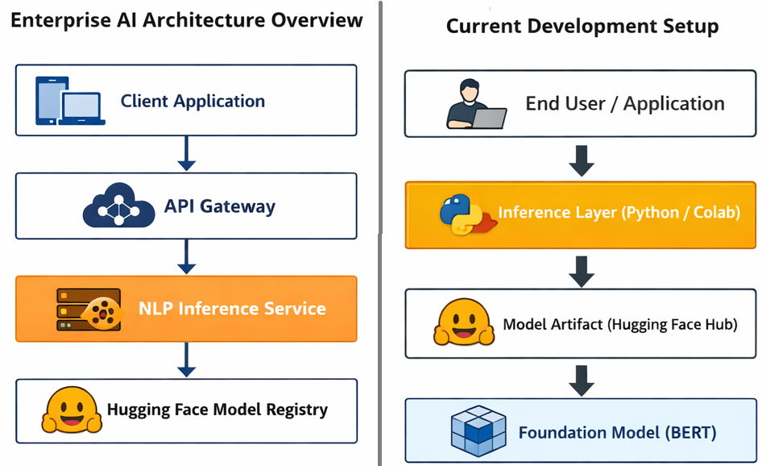
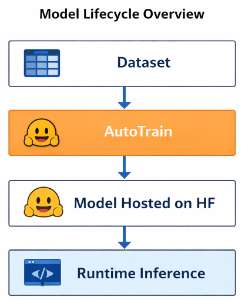

# Overview
Reusable building block demonstrating domain adaptation of a foundation model using managed Auto-train tooling.

# Executive Summary
A pretrained BERT model (**bert-base-uncased**) was fine-tuned using the AutoTrain capabilities of Hugging Face to accelerate domain adaptation.
The resulting model is versioned and hosted on the Hugging Face Hub.
Inference is executed dynamically via the transformers pipeline API, ensuring a lightweight and stateless runtime.
A minimal Gradio interface is provided to demonstrate interactive prediction capability.

This implementation intentionally focuses on the model adaptation and inference layers rather than full production deployment.
It illustrates separation of concerns -
  - model registry,
  - runtime inference, and
  - client interaction.

# Foundation Model Adaptation Approach
  - **Base model**: bert-base-uncased
  - Adaptation via AutoTrain
  - Hosted on Hugging Face Hub
  - Loaded dynamically during inference

# Architecture Overview

<em>
Figure 1: Enterprise solution view vis-a-vis current setup.
</em>

  

# Model Lifecycle

<em>
Figure 3: Dataset → AutoTrain → Model Registry (HF) → Runtime Inference.
</em>

  

# Inference Layer
  - Uses transformers.pipeline
  - Stateless inference
  - Model loaded from HF Hub at runtime
  - Use runtime GPU
  - Lightweight UI using Gradio

# Role as a Building Block
  - Use FastAPI or Flask to expose the model through REST endpoints
  - Can be containerized
  - Cab be integrated for RAG Implementation
  - Should be behind API Gateway
